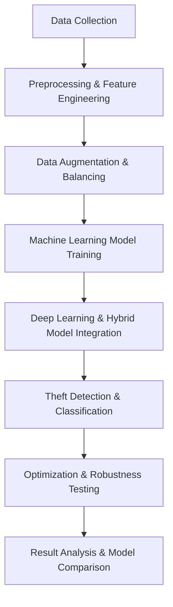

# Smart-Grid-Electricity-Theft-Detection
Smart Grid Electricity Theft Detection Powered by Machine Learning and Advanced Consumption Pattern Analysis

```mermaid
graph TD;
    A[Data Collection] --> B[Preprocessing & Feature Engineering]
    B --> C[Data Augmentation & Balancing]
    C --> D[Machine Learning Model Training]
    D --> E[Deep Learning & Hybrid Model Integration]
    E --> F[Theft Detection & Classification]
    F --> G[Optimization & Robustness Testing]
    G --> H[Result Analysis & Model Comparison]

```